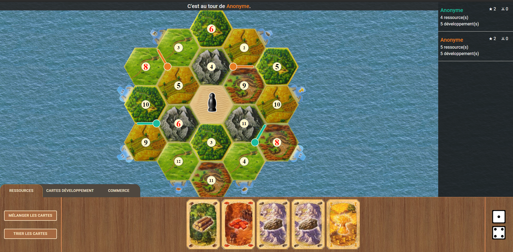

# Palerme

Palerme est une implémentation du célèbre jeu de plateau "Catane". 

Nb: si vous appréciez Catane, vous pouvez acheter le jeu officiel sur [Steam](https://store.steampowered.com/app/544730/Catan_Universe/) ou en [version plateau](https://www.catan.com/board-games) !

## Description du projet

Ce projet est conçu grâce à [boardgame.io](https://boardgame.io), [React](https://reactjs.org/) et [Material-ui](https://material-ui.com/).

Le but de ce projet est de s'exercer à la conception d'un jeu/site web avancé avec un sujet divertissant, pas de remplacer le jeu existant.

Le jeu sera jouable en multijoueur à distance.

## Installation

1. Cloner le repository
3. Exécuter la commande `npm install` pour installer les dépendances.
4. Pour lancer le serveur :  ``npm run server``
5. Dans un autre terminal, lancer le site web : `npm start`

## Statut actuel

- [x] Logique interne du jeu
- [x] Plateau hexagonal
- [x] Objets sur le plateau
  - [x] Routes
  - [x] Colonies
  - [x] Villes
  - [x] Jeton numéroté
  - [x] Ports
  - [x] Pion voleur
- [x] Sélection de cases du plateau
- [x] Panneau latéral contenant la liste des joueurs
- [x] Barre de statut
- [x] Gestion et lancement des dés
- [x] Système de tabs en bas de l'écran
- [x] Affichage des ressources du joueur
- [x] Boutons pour trier / mélanger le jeu d'un joueur
- [x] Affichage des cartes développement du joueur
- [x] Sélecteur de couleur
- [ ] Annulation d'un coup
- [x] Jouer une carte développement
- [x] Minimiser les onglets pour mieux voir le plateau
- [x] Sélecteur de ressource
- [x] Piocher dans la main d'un adversaire
- [x] Bouger le voleur
- [x] Défausser la moitié de ses ressources
- [ ] Achats
- [ ] Commerce maritime
- [ ] Commerce entre les joueurs
- [ ] Fin de partie
- [ ] Lobby
- [ ] Low detail mode

Si tout cela est terminé, il sera alors possible de faire les points suivants :

- [ ] Éditeur de map (parce qu'un JSON n'est pas toujours très pratique)
- [ ] Générateur de map (parce qu'un éditeur n'est pas toujours très pratique)
- [ ] Améliorer la flexibilité du code pour pouvoir supporter des mods (Nouvelles ressources, nouvelles tuiles, ...)
- [ ] Gestion de bateaux (routes sur l'ocean)
- [ ] Rivière d'or (ressource au choix)
- [ ] Rendre certains aspects désactivables (voleur, carte développement spécifique, etc.)